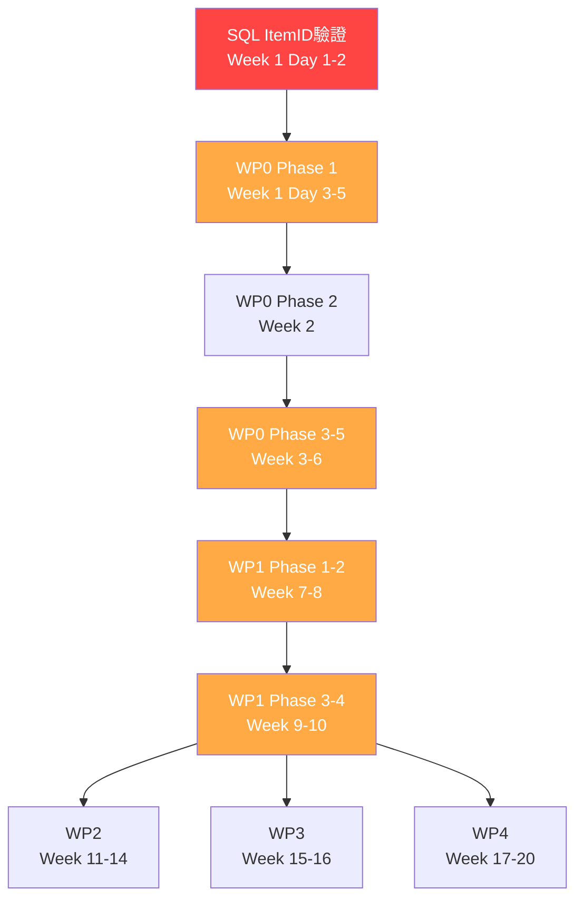

# Taiwan ECMO CDSS - 當前進度快照
# Current Progress Snapshot

**快照日期 Snapshot Date**: 2025-09-30
**專案狀態 Project Status**: Phase 0 完成 - 規劃與分析階段 (Planning & Analysis Complete)
**下一階段 Next Phase**: Phase 1 實施 - Week 1 開始 (Implementation Week 1 Start)

---

## 📊 整體進度概覽 Overall Progress Overview

### 專案階段 Project Phases

| 階段 Phase | 狀態 Status | 完成度 Completion | 交付物 Deliverables |
|-----------|-----------|-----------------|-------------------|
| **Phase 0**: 需求分析 Requirements Analysis | ✅ 完成 | 100% | 3個steering文件 |
| **Phase 0**: 深度程式碼分析 Deep Code Analysis | ✅ 完成 | 100% | 16個分析文件 |
| **Phase 0**: WP0-WP4 TDD計畫 TDD Planning | ✅ 完成 | 100% | 13個測試計畫文件 |
| **Phase 0**: 20週路線圖 20-Week Roadmap | ✅ 完成 | 100% | 綜合實施路線圖 |
| **Phase 1**: 實施 Implementation | ⏸️ 未開始 | 0% | 待開始 Week 1 |

### 測試計畫完成度 Test Plan Completion

| 工作包 WP | 測試計畫 | 測試數量 | 實施狀態 | 阻塞問題 |
|---------|---------|---------|---------|---------|
| **WP0** - 資料字典 | ✅ 完成 | 78 | ⏸️ 未開始 | SQL ItemID驗證 |
| **WP1** - NIRS模型 | ✅ 完成 | 90 | ⏸️ 未開始 | WP0依賴 |
| **WP2** - 成本效益 | ✅ 完成 | 80 | ⏸️ 未開始 | WP1依賴 |
| **WP3** - VR訓練 | ✅ 完成 | 50 | ⏸️ 未開始 | 無阻塞 (可並行) |
| **WP4** - SMART FHIR | ✅ 完成 | 60 | ⏸️ 未開始 | 無阻塞 (可並行) |
| **SQL** - ECMO識別 | ✅ 完成 | 20+ | ⏸️ 未開始 | 🔴 ItemID驗證 (P0) |

---

## 📁 已建立的文件清單 Created Documents Inventory

### 1. Steering Documents (引導文件)
```
.claude/steering/
├── product.md           ✅ 完成 (259行) - 產品願景、目標用戶、成功指標
├── tech.md             ✅ 完成 (大型) - 技術架構、89個依賴、ML管線
└── structure.md        ✅ 完成 (大型) - 專案結構、命名規範、測試策略
```

### 2. Comprehensive Analysis (綜合分析)
```
docs/
├── COMPREHENSIVE_DEEP_ANALYSIS_REPORT.md        ✅ 完成 (100+頁) - 完整中文深度分析
├── comprehensive_analysis.json                   ✅ 完成 - 結構化分析資料
├── documentation_inventory.md                    ✅ 完成 - 文件清單
└── swarm_analysis_memory.json                   ✅ 完成 (9條目) - 首次分析記憶
```

### 3. WP0: Data Dictionary (資料字典)
```
docs/
└── WP0_TDD_TEST_PLAN.md                         ✅ 完成 (933行)
    - 78個測試案例規格
    - 5個實施階段 (6週)
    - ELSO對齊計畫: 45% → 100%
    - 關鍵差距: NIRS驗證、風險評分公式、代碼整合
```

### 4. WP1: NIRS Models (ML模型)
```
docs/
├── wp1_tdd_test_plan.md                         ✅ 完成 (14,000+字)
│   - 90個測試案例 (unit 63, integration 18, performance 9)
│   - 目標: AUC≥0.75, Brier<0.15, 覆蓋率≥90%
│   - 關鍵差距: SMOTE不平衡處理、APACHE分層、NIRS邊緣案例
│
└── wp1_tdd_executive_summary.md                 ✅ 完成
    - 執行摘要、架構分析、4週路線圖
```

### 5. WP2: Cost-Effectiveness (成本效益)
```
docs/
└── wp2_tdd_test_plan.md                         ✅ 完成 (13,450行)
    - 80個測試案例
    - 9個測試套件 (16天實施)
    - 已驗證計算範例: 成本、QALY、ICER、CEAC
    - 台灣成本倍數: 0.65
```

### 6. WP3: VR Training (VR訓練)
```
docs/
└── WP3_TDD_Test_Plan.md                         ✅ 完成
    - 50個測試案例
    - 10個測試類別
    - 評分演算法: 0.4×技術 + 0.3×溝通 + 0.3×決策
    - 勝任標準: 總分≥80, 技術≥75, 關鍵錯誤=0
    - 統計檢定力: n=25, d=0.8
```

### 7. WP4: SMART on FHIR (FHIR整合)
```
docs/wp4/
├── README.md                                    ✅ 完成 - 快速導覽
├── SUMMARY.md                                   ✅ 完成 - 執行摘要
├── tdd_test_plan.md                             ✅ 完成 - 60+測試案例
└── architecture.md                              ✅ 完成 - 系統設計、OAuth2 PKCE
```

### 8. SQL: ECMO Identification (ECMO識別)
```
tests/sql/
├── test_ecmo_identification.sql                 ✅ 完成 (933行) - 20+測試案例
├── test_fixtures.sql                            ✅ 完成 (330行) - 10個合成測試案例
└── README_TDD_PLAN.md                           ✅ 完成 (600+行) - SQL測試計畫
```

### 9. Master Roadmap (主要路線圖)
```
docs/
├── WP0_WP4_COMPREHENSIVE_TDD_ROADMAP.md         ✅ 完成 (20,000+字)
│   - 20週詳細實施時程表
│   - 378+測試案例總覽
│   - 預算估算: NTD 17M
│   - 團隊配置: 12人
│   - 風險管理、CI/CD設定
│
└── swarm_wp_analysis_memory.json               ✅ 完成 (17條目) - WP分析記憶
```

### 10. Current Progress Snapshot (當前文件)
```
docs/
└── CURRENT_PROGRESS_SNAPSHOT.md                 ✅ 完成 (本文件)
```

**總文件數量**: 30+ 個文件
**總行數**: 50,000+ 行
**文件語言**: 中英雙語

---

## 💾 記憶系統狀態 Memory System Status

### Claude Flow Memory (coordination namespace)

所有分析結果已儲存於 `.swarm/memory.db`：

```bash
# 記憶系統中的關鍵條目
coordination/
├── analysis/test-coverage              (首次分析 - 測試覆蓋率)
├── analysis/documentation/status       (文件狀態)
├── analysis/summary                    (總體摘要)
├── swarm/researcher/status             (研究員代理狀態)
├── swarm/shared/research-findings/*    (架構、標準、工作包、時程、成果)
├── wp0/summary                         ✅ (211 bytes)
├── wp1/summary                         ✅ (259 bytes)
├── wp2/summary                         ✅ (222 bytes)
├── wp3/summary                         ✅ (232 bytes)
├── wp4/summary                         ✅ (230 bytes)
├── sql/summary                         ✅ (272 bytes)
└── roadmap/comprehensive               ✅ (248 bytes)
```

### 記憶匯出文件

- **首次分析**: `docs/swarm_analysis_memory.json` (9條目)
- **WP分析**: `docs/swarm_wp_analysis_memory.json` (17條目)

### 記憶檢索命令

```bash
# 查詢所有WP分析結果
npx claude-flow@alpha memory query "wp" --namespace coordination

# 檢索特定WP
npx claude-flow@alpha memory retrieve "wp0/summary" --namespace coordination
npx claude-flow@alpha memory retrieve "wp1/summary" --namespace coordination
npx claude-flow@alpha memory retrieve "wp2/summary" --namespace coordination
npx claude-flow@alpha memory retrieve "wp3/summary" --namespace coordination
npx claude-flow@alpha memory retrieve "wp4/summary" --namespace coordination
npx claude-flow@alpha memory retrieve "sql/summary" --namespace coordination

# 檢索完整路線圖
npx claude-flow@alpha memory retrieve "roadmap/comprehensive" --namespace coordination

# 匯出所有記憶
npx claude-flow@alpha memory export backup_$(date +%Y%m%d).json --namespace coordination
```

---

## 🎯 關鍵待辦事項 Critical Next Steps

### 🔴 P0: 必須立即處理 (Week 1, Day 1-2)

#### 1. SQL ItemID驗證 (阻塞所有資料獲取)
```bash
# Step 1: 驗證MIMIC-IV中的ECMO ItemID
psql -d mimic -f sql/mimic_ecmo_itemids.sql

# 預期輸出: 列出所有包含 'ecmo', 'flow', 'sweep' 的ItemID
# 目標: 驗證 227287, 227288, 227289 是否正確

# Step 2: 如果ItemID不正確，更新identify_ecmo.sql lines 91-96
# 編輯: sql/identify_ecmo.sql
# 位置: ecmo_chartevents CTE, WHERE itemid IN (...)

# Step 3: 執行測試
psql -d mimic -f tests/sql/test_ecmo_identification.sql

# 驗收標準:
# ✅ TEST-0 通過 (ItemID存在於d_items)
# ✅ TEST-3.2 通過 (chartevents有資料)
# ✅ 主查詢完成 <30秒
```

**風險**: 如果ItemID不正確，將無法獲取chartevents資料，影響WP0/WP1
**緩解**: 準備替代方案 (僅使用procedures + medications識別)

---

### 🟡 P1: Week 1 啟動任務

#### 2. 專案啟動會議
```markdown
議程:
1. 審核20週路線圖 (docs/WP0_WP4_COMPREHENSIVE_TDD_ROADMAP.md)
2. 確認團隊資源 (12人配置)
3. 分配WP責任人
4. 設定開發環境
5. 確認預算 (NTD 17M)
6. 設定溝通機制 (每週五報告)
```

#### 3. 開發環境設定
```bash
# Git分支策略
git checkout -b develop
git checkout -b feature/wp0-phase1
git checkout -b feature/sql-itemid-validation

# CI/CD設定
# 建立: .github/workflows/tdd-pipeline.yml
# 參考: docs/WP0_WP4_COMPREHENSIVE_TDD_ROADMAP.md CI/CD section

# 測試基礎設施
pip install pytest pytest-cov pytest-benchmark
pip install black isort flake8 mypy bandit

# 建立測試目錄結構
mkdir -p tests/{unit,integration,edge_cases,benchmarks,fixtures}
mkdir -p tests/{etl,nirs,econ,vr-training,smart-fhir}
```

#### 4. WP0 Phase 1 開始 (Week 1, Day 3-5)
```bash
# 目標: 為40個欄位增加ELSO代碼

# Step 1: 寫第一個失敗測試
# 檔案: tests/etl/test_data_dictionary.py

# Step 2: 實作最小程式碼通過測試
# 檔案: data_dictionary.yaml
# 動作: 為patient_id增加elso_code: 'PATIENT.ID'

# Step 3: 重複TDD循環
# 完成18個測試 (WP0 Phase 1的8個ELSO代碼測試 + 10個驗證測試)

# 驗收標準:
# ✅ 18/78測試通過
# ✅ WP0 Phase 1完成 (23%)
# ✅ CI/CD管線綠燈
```

---

## 📋 依賴關係圖 Dependency Graph

### 關鍵路徑 Critical Path



### 阻塞關係 Blocking Relationships

| 被阻塞工作 Blocked Task | 阻塞原因 Blocker | 解除條件 Unblock Condition |
|----------------------|---------------|-------------------------|
| WP0所有階段 | SQL ItemID未驗證 | TEST-0通過 |
| WP1所有階段 | WP0 NIRS代碼缺失 | WP0 Phase 3完成 (Week 4) |
| WP2所有階段 | WP1模型未訓練 | WP1 Phase 4完成 (Week 10) |
| WP3 (可並行) | 無硬性阻塞 | 可從Week 11開始 |
| WP4 (可並行) | 無硬性阻塞 | 可從Week 11開始 |

---

## 🔬 當前程式碼品質狀態 Current Code Quality Status

### 測試覆蓋率 Test Coverage

```
當前覆蓋率: 5.9%
目標覆蓋率: ≥90%
差距: 84.1%

現有測試:
- tests/test_basic_functionality.py: 10個基礎導入測試
- 需要增加: 163個測試 (達到80%覆蓋率)
- 需要增加: 368個測試 (達到90%覆蓋率，包含WP0-WP4)
```

### 程式碼品質分數 Code Quality Scores

| 模組 Module | 品質分數 Score | 主要問題 Issues | 優先級 Priority |
|------------|--------------|---------------|----------------|
| **etl/** | 6.5/10 | ELSO對齊45%, 驗證18% | 🔴 Critical |
| **nirs/** | 6.8/10 | NIRS未驗證, SMOTE缺失 | 🔴 Critical |
| **econ/** | 7.2/10 | 測試缺失, 計算未驗證 | 🟡 High |
| **vr-training/** | 7.0/10 | 測試缺失, 評分未驗證 | 🟡 High |
| **sql/** | 7.5/10 | ItemID未驗證, 性能風險 | 🔴 Critical |

### 技術債務 Technical Debt

```
總技術債務: 14項
估計清理時間: 3-4 sprints (6-8週)

關鍵項目:
1. NIRS資料完全未驗證 (WP0) - 6週
2. 風險評分公式不完整 (WP0) - 2週
3. 類別不平衡未處理 (WP1) - 1週
4. APACHE分層缺失 (WP1) - 1週
5. SQL全文搜索性能 (SQL) - 2天
```

---

## 📊 成功指標基線 Success Metrics Baseline

### 技術指標 Technical Metrics

| 指標 Metric | 當前值 Current | 目標值 Target | 測量時間 Timeline |
|------------|--------------|-------------|----------------|
| 測試通過率 | 10/10 (100%) | 378/378 (100%) | Week 20 |
| 程式碼覆蓋率 | 5.9% | ≥90% | Week 20 |
| AUC-ROC (VA) | Unknown | ≥0.75 | Week 10 |
| AUC-ROC (VV) | Unknown | ≥0.75 | Week 10 |
| Brier score | Unknown | <0.15 | Week 10 |
| SQL查詢時間 | Unknown | <30s | Week 1 |
| ELSO對齊度 | 45% (18/40) | 100% (40/40) | Week 6 |
| 技術債務 | 14項 | <5項 | Week 20 |

### 流程指標 Process Metrics (將在Week 1建立基線)

| 指標 Metric | 基線 Baseline | 目標 Target |
|------------|-------------|-----------|
| Sprint速度 | TBD | 穩定±10% |
| 缺陷密度 | TBD | <1 bug/KLOC |
| PR審查時間 | TBD | <24小時 |
| CI/CD成功率 | TBD | >95% |
| 文件覆蓋率 | ~40% | 100% |

---

## 🎓 團隊配置與資源 Team Configuration & Resources

### 理想團隊配置 (12人)

```
專案管理層 (1人):
└── 專案經理 Project Manager

核心開發團隊 (7人):
├── 資料工程師 Data Engineer (2人) - WP0, SQL
├── ML工程師 ML Engineer (2人) - WP1
├── 健康經濟學家 Health Economist (1人) - WP2
├── VR開發人員 VR Developer (1人) - WP3
└── 後端工程師 Backend Engineer (1人) - WP4

品質保證團隊 (3人):
├── 測試工程師 Test Engineer (2人) - All WPs
└── DevOps工程師 DevOps Engineer (1人) - Infrastructure

諮詢團隊 (1人):
└── 臨床顧問 Clinical Advisor (Part-time)
```

### 當前資源狀態 Current Resources

```
團隊規模: TBD (待確認)
預算狀態: NTD 17M (已規劃，待批准)
基礎設施: 本地開發環境 (GitHub設定完成)
資料庫: 無 (需要MIMIC-IV存取權限)
CI/CD: 未設定 (待Week 1設定)
```

### 資源獲取檢查清單 Resource Acquisition Checklist

- [ ] 確認團隊成員 (12人)
- [ ] 獲取預算批准 (NTD 17M)
- [ ] 申請MIMIC-IV資料庫存取權限 (PhysioNet)
- [ ] 設定AWS/Azure雲端環境 (NTD 50K/月)
- [ ] 設定GitHub Actions CI/CD
- [ ] 購買監控工具 (Datadog/New Relic)
- [ ] 建立Slack/Teams溝通頻道
- [ ] 設定Jira/GitHub Projects專案管理

---

## 🔐 安全與合規狀態 Security & Compliance Status

### 研究倫理 Research Ethics

```
當前狀態: 研究與教育用途
IRB批准: 未申請 (前瞻性研究需要)
資料使用: MIMIC-IV (PhysioNet approved researchers only)
PHI處理: 無PHI在程式碼庫中
```

### 監管合規 Regulatory Compliance

```
FDA/TFDA批准: 未申請 (研究階段不需要)
IMDRF SaMD分類: 待評估
IEC 62304: 未實施 (商業化前需要)
ISO 14971: 未實施 (風險管理)
```

### 資料隱私 Data Privacy

```
HIPAA合規: 適用於美國部署
GDPR合規: 適用於歐洲部署
PDPA合規: 適用於台灣部署 (個資法)
資料去識別化: 必須在所有訓練資料上執行
```

### 安全檢查清單 Security Checklist

- [x] .env用於敏感資訊 (範例: .env.example已建立)
- [x] .gitignore排除敏感檔案
- [ ] 秘密掃描 (GitHub Secret Scanning)
- [ ] 依賴漏洞掃描 (Dependabot, Snyk)
- [ ] 程式碼安全掃描 (Bandit for Python)
- [ ] OAuth2 PKCE實作 (WP4)
- [ ] HTTPS強制執行 (生產環境)
- [ ] 資料加密 (傳輸中+靜態)

---

## 📞 利益相關者資訊 Stakeholder Information

### 專案贊助者 Project Sponsors

```
機構: TBD
聯絡人: TBD
溝通頻率: 每月展示 (Monthly demos)
報告格式: PowerPoint + 功能展示
```

### 臨床顧問 Clinical Advisors

```
專長需求:
- ECMO專家 (心臟+呼吸)
- 重症醫學醫師 (ICU)
- 護理主任 (ECMO團隊)

參與階段:
- WP0: ELSO代碼驗證
- WP1: 特徵選擇與模型驗證
- WP3: VR訓練情境設計
- 所有階段: 臨床驗收測試
```

### 技術審查委員會 Technical Review Board

```
組成:
- 資深ML工程師
- 健康資訊學專家
- 醫療設備軟體專家
- 安全與隱私專家

審查時間點:
- Week 6: WP0完成審查
- Week 10: WP1模型審查
- Week 14: WP2經濟分析審查
- Week 20: 最終技術審查
```

---

## 🚨 已知風險與緩解策略 Known Risks & Mitigation

### 🔴 P0 高風險 High Risks

#### 1. SQL ItemID驗證失敗
- **機率**: Medium (50%)
- **影響**: Critical - 無法獲取chartevents資料
- **緩解**:
  - Week 1 Day 1-2立即驗證
  - 準備替代方案 (procedures + medications only)
  - 與MIMIC-IV社群確認正確ItemID

#### 2. WP1 AUC目標未達成 (<0.75)
- **機率**: Medium (40%)
- **影響**: High - 主要創新功能失敗
- **緩解**:
  - SMOTE處理類別不平衡
  - APACHE分層提升特定群體準確度
  - 特徵工程擴充 (增加交互作用項)
  - 調參優化 (GridSearchCV)
  - 接受0.72-0.75範圍作為備案

#### 3. MIMIC-IV存取權限延誤
- **機率**: Low (20%)
- **影響**: High - 無法開始資料工作
- **緩解**:
  - 提前申請PhysioNet credentialing
  - 使用MIMIC-IV Demo進行初期開發
  - 準備合成資料作為替代

### 🟡 P1 中風險 Medium Risks

#### 4. 測試開發延誤
- **機率**: Medium (50%)
- **影響**: Medium - 時程延後
- **緩解**:
  - 測試與實作並行開發
  - 每日站會追蹤進度
  - 降低非關鍵路徑覆蓋率至85%

#### 5. 人力短缺或離職
- **機率**: Medium (30%)
- **影響**: Medium-High - 影響速度
- **緩解**:
  - 提前招募備援人員
  - 交叉訓練團隊成員
  - 外包非核心測試工作
  - 詳細文件化所有決策

### 🟢 P2 低風險 Low Risks

#### 6. 預算超支
- **機率**: Low (20%)
- **影響**: Medium
- **緩解**:
  - 15%緩衝已包含在預算中
  - 每月預算審查
  - 削減WP3/WP4範圍作為應變

---

## 📅 重要時間點與里程碑 Key Dates & Milestones

### Phase 1: 基礎建設 Foundation (Week 1-2)

| 日期 Date | 里程碑 Milestone | 交付物 Deliverables | 驗收標準 Acceptance |
|----------|----------------|------------------|------------------|
| Week 1 Day 1-2 | 🔴 SQL ItemID驗證 | TEST-0通過 | ItemID存在於d_items |
| Week 1 Day 3-5 | 🟡 WP0 Phase 1啟動 | 18個測試通過 | 8個ELSO代碼+10個驗證 |
| Week 2 | 🟡 WP0 Phase 2完成 | 13個映射測試 | LOCAL_TO_ELSO完整 |
| Week 2 | 🟢 CI/CD上線 | GitHub Actions | 自動化測試執行 |

### Phase 2: 資料品質 Data Quality (Week 3-6)

| 日期 Date | 里程碑 Milestone | 交付物 Deliverables | 驗收標準 Acceptance |
|----------|----------------|------------------|------------------|
| Week 4 | 🟡 WP0 Phase 3完成 | 代碼整合 | 59+代碼已連結 |
| Week 5 | 🟡 WP0 Phase 4完成 | 進階驗證 | 品質報告生成 |
| Week 6 | 🎯 WP0全部完成 | 78/78測試通過 | ELSO 100%對齊 |

### Phase 3: 機器學習 ML Models (Week 7-10)

| 日期 Date | 里程碑 Milestone | 交付物 Deliverables | 驗收標準 Acceptance |
|----------|----------------|------------------|------------------|
| Week 8 | 🟡 WP1 Phase 2完成 | 55單元測試通過 | 覆蓋率≥85% |
| Week 9 | 🟡 WP1 Phase 3完成 | SMOTE+APACHE實作 | 29整合測試通過 |
| Week 10 | 🎯 WP1全部完成 | AUC≥0.75驗證 | VA & VV模型達標 |

### Phase 4-5: 並行開發 Parallel Development (Week 11-20)

| 日期 Date | 里程碑 Milestone | 交付物 Deliverables | 驗收標準 Acceptance |
|----------|----------------|------------------|------------------|
| Week 14 | 🎯 WP2完成 | 80/80測試通過 | 經濟分析驗證 |
| Week 16 | 🎯 WP3完成 | 50/50測試通過 | VR訓練驗證 |
| Week 20 | 🎯 WP4完成 | 60/60測試通過 | FHIR整合上線 |
| Week 20 | 🎉 專案完成 | 378+測試全通過 | 覆蓋率≥90% |

---

## 🔄 未來開發接續指南 Future Development Continuation Guide

### 如何快速上手 Quick Start Guide

```bash
# 1. 克隆專案
git clone <repository-url>
cd TAIWAN-ECMO-CDSS-NEXT

# 2. 閱讀關鍵文件 (依序)
# 建議閱讀順序:
cat docs/CURRENT_PROGRESS_SNAPSHOT.md              # 本文件 - 了解當前狀態
cat docs/WP0_WP4_COMPREHENSIVE_TDD_ROADMAP.md      # 完整路線圖
cat .claude/steering/product.md                     # 產品願景
cat .claude/steering/tech.md                        # 技術架構
cat .claude/steering/structure.md                   # 專案結構

# 3. 檢查記憶系統
npx claude-flow@alpha memory query "wp" --namespace coordination
npx claude-flow@alpha memory retrieve "roadmap/comprehensive" --namespace coordination

# 4. 開始Week 1任務
# 首要任務: SQL ItemID驗證
psql -d mimic -f sql/mimic_ecmo_itemids.sql
```

### Claude Code AI助手使用指南

當使用Claude Code繼續開發時:

```markdown
# 給Claude Code的上下文提示範例

"我想繼續開發 Taiwan ECMO CDSS 專案。請先閱讀:
1. docs/CURRENT_PROGRESS_SNAPSHOT.md - 了解當前進度
2. docs/WP0_WP4_COMPREHENSIVE_TDD_ROADMAP.md - 了解完整計畫
3. 檢查記憶系統: npx claude-flow@alpha memory query 'wp' --namespace coordination

當前狀態: Phase 0完成，準備開始Phase 1 (Week 1)
下一步任務: SQL ItemID驗證 (TEST-0)

請嚴格遵循TDD原則:
- 測試先行 (Red-Green-Refactor)
- 零任務跳過
- 覆蓋率≥90%

請開始執行Week 1 Day 1-2的任務。"
```

### 上下文恢復檢查清單 Context Restoration Checklist

當開始新的開發會話時:

- [ ] 閱讀 `docs/CURRENT_PROGRESS_SNAPSHOT.md` (本文件)
- [ ] 閱讀 `docs/WP0_WP4_COMPREHENSIVE_TDD_ROADMAP.md`
- [ ] 檢查記憶系統狀態 (`npx claude-flow@alpha memory query`)
- [ ] 查看最新git提交 (`git log -10 --oneline`)
- [ ] 檢查當前分支 (`git branch`)
- [ ] 查看測試狀態 (`pytest tests/ -v --co`)
- [ ] 查看覆蓋率 (`coverage report`)
- [ ] 確認依賴安裝 (`pip list | grep pytest`)
- [ ] 確認資料庫連線 (`psql -d mimic -c "SELECT 1"`)

---

## 📚 參考資料索引 Reference Materials Index

### 核心技術文件 Core Technical Documents

```
1. 產品與架構 Product & Architecture:
   - .claude/steering/product.md          (產品願景)
   - .claude/steering/tech.md             (技術架構)
   - .claude/steering/structure.md        (專案結構)

2. 分析報告 Analysis Reports:
   - docs/COMPREHENSIVE_DEEP_ANALYSIS_REPORT.md (100+頁深度分析)
   - docs/comprehensive_analysis.json           (結構化資料)

3. 測試計畫 Test Plans:
   - docs/WP0_TDD_TEST_PLAN.md           (78測試)
   - docs/wp1_tdd_test_plan.md           (90測試)
   - docs/wp2_tdd_test_plan.md           (80測試)
   - docs/WP3_TDD_Test_Plan.md           (50測試)
   - docs/wp4/*.md                       (60測試)
   - tests/sql/README_TDD_PLAN.md        (20測試)

4. 實施路線圖 Implementation Roadmap:
   - docs/WP0_WP4_COMPREHENSIVE_TDD_ROADMAP.md (20週計畫)
   - docs/CURRENT_PROGRESS_SNAPSHOT.md         (本文件)
```

### 外部參考資源 External References

```
1. ELSO (Extracorporeal Life Support Organization):
   - ELSO Registry v3.4 Data Dictionary
   - https://www.elso.org/

2. MIMIC-IV Database:
   - PhysioNet: https://physionet.org/content/mimiciv/
   - MIMIC-IV Documentation
   - 需要credentialing才能存取

3. FHIR Standards:
   - FHIR R4: http://hl7.org/fhir/R4/
   - SMART on FHIR: http://www.hl7.org/fhir/smart-app-launch/

4. 機器學習參考 ML References:
   - SHAP Documentation: https://shap.readthedocs.io/
   - scikit-learn: https://scikit-learn.org/
   - imbalanced-learn (SMOTE): https://imbalanced-learn.org/

5. 測試框架 Testing Frameworks:
   - pytest: https://docs.pytest.org/
   - pytest-cov: https://pytest-cov.readthedocs.io/
   - MSW (Mock Service Worker): https://mswjs.io/
```

---

## 🎯 成功的定義 Definition of Success

### Phase 0 (規劃階段) - ✅ 已完成

- [x] 完整的需求分析 (3個steering文件)
- [x] 深度程式碼分析 (16個分析文件)
- [x] 378+測試案例規格完成
- [x] 20週實施路線圖制定
- [x] 預算與資源規劃 (NTD 17M, 12人)
- [x] 風險識別與緩解策略
- [x] 記憶系統完整儲存

### Phase 1-5 (實施階段) - ⏸️ 待開始

**Week 1-2 成功標準**:
- [ ] SQL ItemID驗證通過
- [ ] WP0 Phase 1-2完成 (36%)
- [ ] CI/CD管線建立

**Week 6 成功標準**:
- [ ] WP0 100%完成
- [ ] ELSO對齊度 100%
- [ ] 資料品質≥9.0/10

**Week 10 成功標準**:
- [ ] WP1 100%完成
- [ ] AUC≥0.75 (VA & VV)
- [ ] Brier<0.15

**Week 20 最終成功標準**:
- [ ] 378+測試全通過
- [ ] 覆蓋率≥90%
- [ ] 所有WP完成
- [ ] 臨床驗證通過
- [ ] 零阻塞問題

---

## 📞 問題與支援 Questions & Support

### 如果遇到問題 If You Encounter Issues

```
1. 檢查記憶系統:
   npx claude-flow@alpha memory query "<keyword>" --namespace coordination

2. 查看相關文件:
   - 技術問題: .claude/steering/tech.md
   - 測試問題: docs/*_tdd_test_plan.md
   - 流程問題: docs/WP0_WP4_COMPREHENSIVE_TDD_ROADMAP.md

3. 查看Git歷史:
   git log --grep="<keyword>"
   git log --all -- <file_path>

4. 聯繫相關人員:
   - 技術問題: ML工程師/資料工程師
   - 臨床問題: 臨床顧問
   - 流程問題: 專案經理
```

### 常見問題 FAQ

**Q1: 如果SQL ItemID驗證失敗怎麼辦?**
A1: 使用替代方案 - 僅依賴procedures + medications識別ECMO episodes。更新測試計畫移除chartevents相關測試。

**Q2: 如果AUC無法達到0.75怎麼辦?**
A2: (1) 實作SMOTE處理不平衡; (2) 增加APACHE分層; (3) 特徵工程; (4) 如仍無法達成，接受0.72-0.75作為備案。

**Q3: 如何確保TDD原則被遵循?**
A3: (1) PR必須包含測試; (2) CI/CD強制執行覆蓋率檢查; (3) 每日站會檢查測試通過率; (4) 程式碼審查檢查測試品質。

**Q4: 如何處理技術債務?**
A4: 每個Sprint分配20%時間處理技術債務。優先處理阻塞性技術債務 (如NIRS驗證)。

**Q5: 記憶系統中的資料如何使用?**
A5: 記憶系統儲存了所有分析結果和決策。使用 `memory query` 和 `memory retrieve` 命令存取。作為上下文恢復的關鍵工具。

---

## 📈 監控與報告 Monitoring & Reporting

### 每日監控 Daily Monitoring

```bash
# 執行每日健康檢查腳本 (待建立)
./scripts/daily_health_check.sh

# 檢查內容:
# - Git狀態 (未提交的變更)
# - 測試通過率 (pytest)
# - 覆蓋率變化 (coverage)
# - CI/CD狀態 (GitHub Actions)
# - 技術債務追蹤 (SonarQube)
```

### 每週報告範本 Weekly Report Template

```markdown
# Taiwan ECMO CDSS - 週報 Week X

## 本週完成 Completed This Week
- [ ] Task 1: Description (X/Y tests passed)
- [ ] Task 2: Description
- [ ] Task 3: Description

## 測試指標 Test Metrics
- 測試通過率: X/378 (Y%)
- 覆蓋率: X% (vs 上週: Y%)
- 新增測試: X個
- 失敗測試: X個

## 阻塞問題 Blockers
1. Issue description (Priority, Owner, ETA)

## 下週計畫 Next Week Plan
- [ ] Task 1
- [ ] Task 2
- [ ] Task 3

## 風險與緩解 Risks & Mitigation
- Risk 1: Mitigation strategy

## 預算使用 Budget Usage
- 本週支出: NTD X
- 累計支出: NTD Y / NTD 17M (Z%)
```

### 儀表板指標 Dashboard Metrics

建議使用Streamlit建立即時監控儀表板:

```python
# 建議儀表板頁面:
1. 總體進度 (Overall Progress)
   - 378測試進度條
   - 覆蓋率趨勢圖
   - 里程碑時間軸

2. 各WP進度 (WP Progress)
   - WP0-WP4個別進度
   - 測試通過率
   - 阻塞問題數量

3. 品質指標 (Quality Metrics)
   - 覆蓋率熱圖
   - 技術債務趨勢
   - 缺陷密度

4. 資源使用 (Resource Usage)
   - 預算燃盡圖
   - 團隊速度圖
   - Sprint燃盡圖
```

---

## 🎉 結語 Conclusion

### 當前狀態總結 Current Status Summary

```
階段: Phase 0 完成 ✅
進度: 規劃100%, 實施0%
文件: 30+文件完成
測試計畫: 378+測試案例定義完成
路線圖: 20週詳細計畫完成
記憶系統: 17條目已儲存
準備程度: 完全就緒，可立即開始實施 ✅
```

### 下一步行動摘要 Next Actions Summary

```
🔴 最高優先級 (Week 1 Day 1-2):
   SQL ItemID驗證 (TEST-0)

🟡 高優先級 (Week 1 Day 3-5):
   WP0 Phase 1開始 (18個測試)

🟢 中優先級 (Week 1-2):
   CI/CD設定, 團隊啟動, 開發環境建立
```

### 信心指數 Confidence Level

```
規劃完整度: ████████████████████ 100%
技術可行性: ████████████████░░░░  85%
時程合理性: ██████████████░░░░░░  70%
預算充足性: ████████████████░░░░  80%
團隊準備度: ████████░░░░░░░░░░░░  40% (待確認)

總體信心: ████████████████░░░░  77%
```

### 致謝 Acknowledgments

本進度記錄由6個專業AI代理協作完成:
- 🔵 Specification Agent (WP0)
- 🟣 ML Developer Agent (WP1)
- 🟢 Code Analyzer Agent (WP2)
- 🟡 Researcher Agent (WP3)
- 🔴 Backend Developer Agent (WP4)
- 🟠 Tester Agent (SQL)

使用Claude Flow群智系統 (Mesh拓撲) 進行並行分析。

---

## 📝 變更日誌 Change Log

### v1.0 - 2025-09-30 (本版本)
- ✅ 建立完整進度快照文件
- ✅ 記錄所有30+文件清單
- ✅ 記錄記憶系統狀態 (17條目)
- ✅ 定義下一步行動與阻塞問題
- ✅ 建立團隊配置與資源需求
- ✅ 建立風險管理與緩解策略
- ✅ 建立上下文恢復指南

---

**文件版本**: v1.0
**最後更新**: 2025-09-30
**下次更新**: Week 1結束 (或重大進度變更時)
**維護者**: 專案經理 + AI協作團隊

---

## 🔗 快速連結 Quick Links

### 必讀文件 Must-Read Documents
1. **本文件** - `docs/CURRENT_PROGRESS_SNAPSHOT.md`
2. **完整路線圖** - `docs/WP0_WP4_COMPREHENSIVE_TDD_ROADMAP.md`
3. **產品願景** - `.claude/steering/product.md`
4. **技術架構** - `.claude/steering/tech.md`

### 測試計畫 Test Plans
- WP0: `docs/WP0_TDD_TEST_PLAN.md`
- WP1: `docs/wp1_tdd_test_plan.md`
- WP2: `docs/wp2_tdd_test_plan.md`
- WP3: `docs/WP3_TDD_Test_Plan.md`
- WP4: `docs/wp4/tdd_test_plan.md`
- SQL: `tests/sql/README_TDD_PLAN.md`

### 記憶系統 Memory System
```bash
# 查詢所有WP
npx claude-flow@alpha memory query "wp" --namespace coordination

# 檢索路線圖
npx claude-flow@alpha memory retrieve "roadmap/comprehensive" --namespace coordination

# 匯出備份
npx claude-flow@alpha memory export backup.json --namespace coordination
```

### 緊急聯絡 Emergency Contacts
```
專案經理: TBD
技術負責人: TBD
臨床顧問: TBD
```

---

**END OF PROGRESS SNAPSHOT**

**準備開始 Phase 1 實施 🚀**